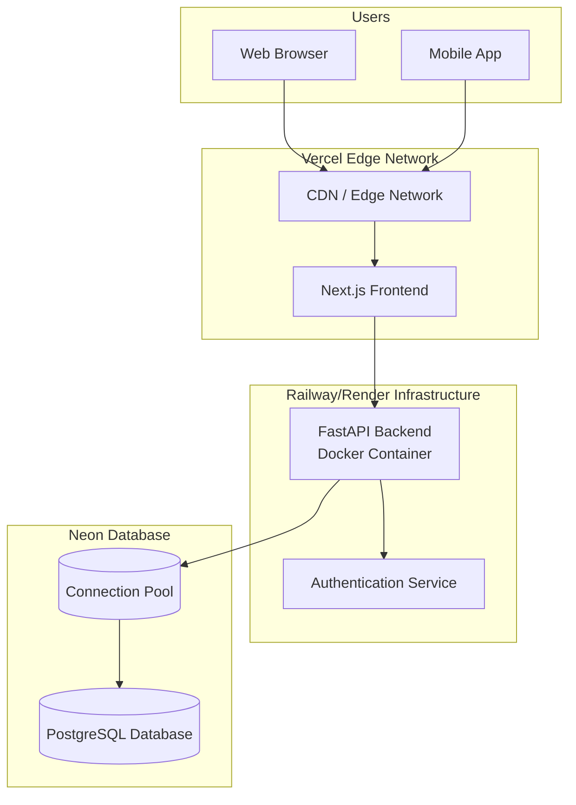
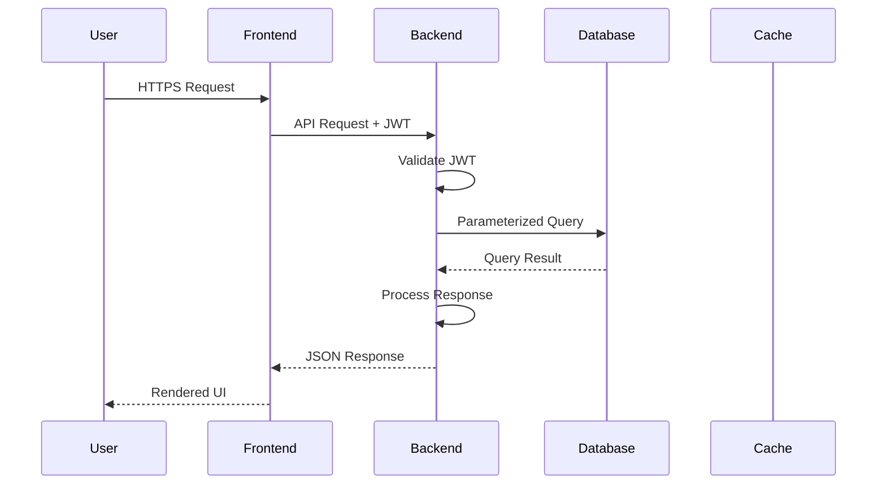
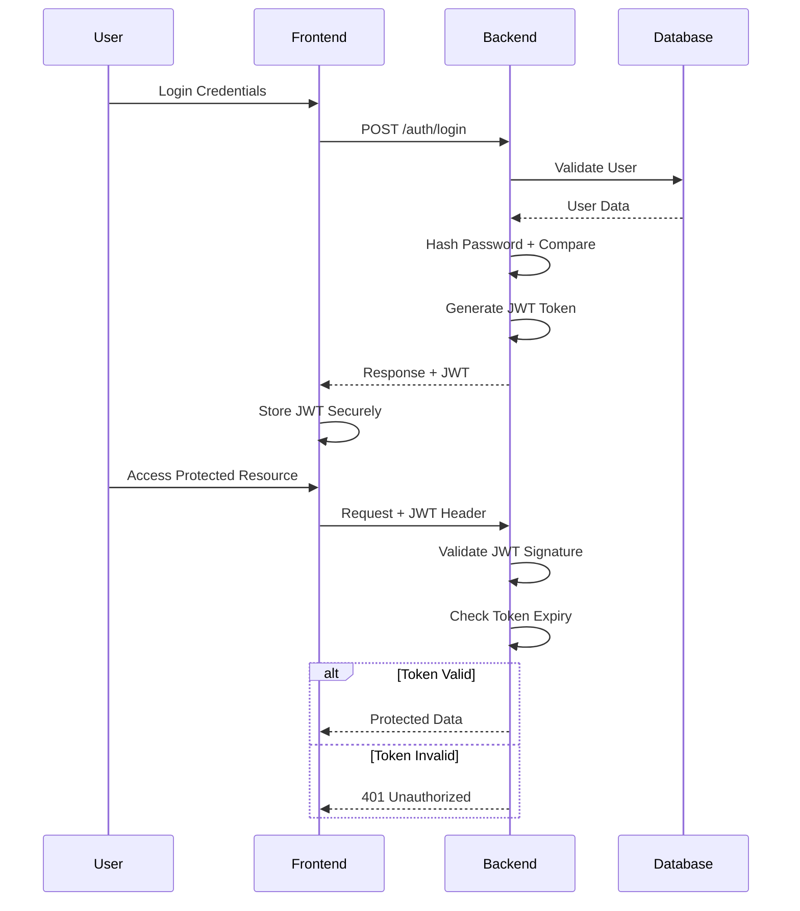
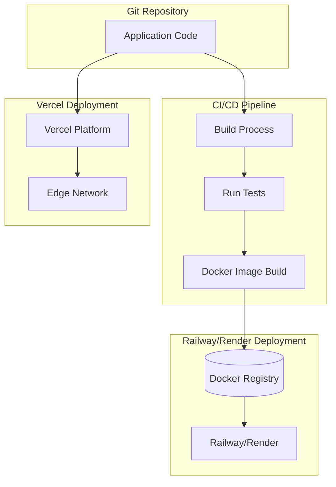
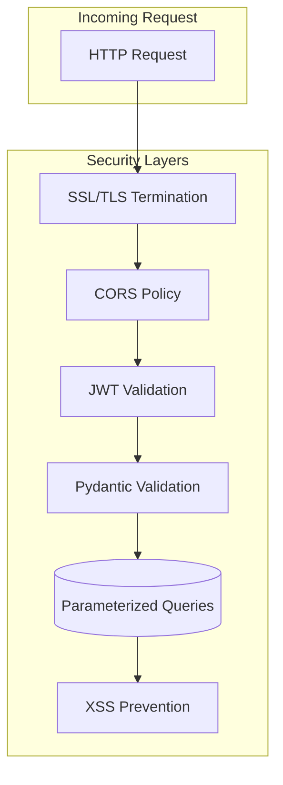
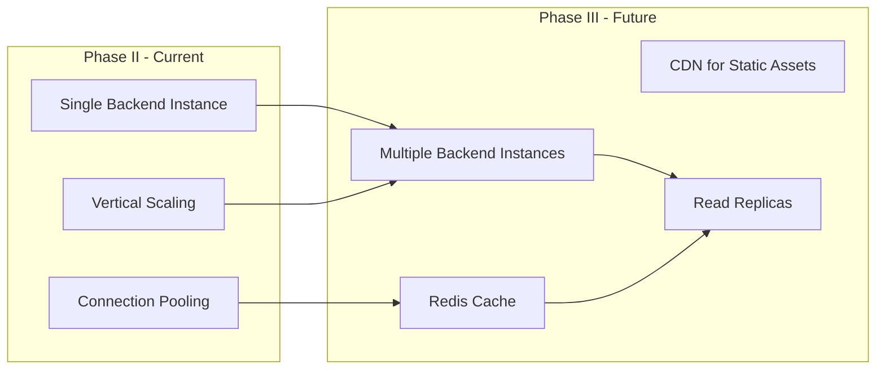
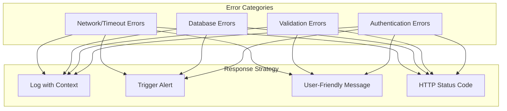

# Feature Specification: Deployment Architecture

**Feature Branch**: `005-deployment-architecture`
**Created**: 2026-01-01
**Status**: Draft
**Input**: User description: deployment, scalability, and security architecture specification

## User Scenarios & Testing *(mandatory)*

<!--
  For infrastructure/architecture features, user scenarios focus on operational journeys
  that stakeholders (devops, developers, security teams) need to accomplish.
-->

### Operational Story 1 - Production Deployment (Priority: P1)

As a DevOps engineer, I need to deploy the application to production with automated HTTPS and SSL certificates so that the application is accessible to users with secure connections.

**Why this priority**: This is the foundation for all production use. Without proper deployment, no users can access the system.

**Independent Test**: Can be tested by verifying the production URL loads with a valid HTTPS certificate and all environment variables are properly configured.

**Acceptance Scenarios**:

1. **Given** the application code is committed, **When** deployment is triggered, **Then** the frontend should be accessible at the production URL within 5 minutes.
2. **Given** deployment completes, **When** users visit the production URL, **Then** the connection should use HTTPS with a valid SSL certificate.
3. **Given** the production environment is running, **When** backend API calls are made, **Then** responses should be served from the Railway/Render instance.

---

### Operational Story 2 - Secure Data Access (Priority: P1)

As a security engineer, I need to ensure all user data is protected through authentication, authorization, and input validation so that unauthorized access and attacks are prevented.

**Why this priority**: Security breaches can cause legal liability, data loss, and loss of user trust. This is a fundamental requirement.

**Independent Test**: Can be tested by attempting unauthorized access, malformed requests, and verifying authentication is enforced.

**Acceptance Scenarios**:

1. **Given** a user is not authenticated, **When** they attempt to access protected resources, **Then** the request should be rejected with an appropriate error.
2. **Given** a user is authenticated, **When** they request data belonging to another user, **Then** the request should be rejected with an authorization error.
3. **Given** a malicious actor submits malformed input, **When** the system processes the request, **Then** the input should be validated and rejected if invalid.

---

### Operational Story 3 - Scalable Infrastructure (Priority: P2)

As a system architect, I need the infrastructure to support current Phase II requirements while enabling future scalability so that the application can grow with user demand.

**Why this priority**: Phase II must work now, but the architecture should not create technical debt that prevents future scaling.

**Independent Test**: Can be verified by reviewing architecture documentation and confirming connection pooling and scaling paths are defined.

**Acceptance Scenarios**:

1. **Given** Phase II infrastructure is configured, **When** the application is under load, **Then** connection pooling should prevent database exhaustion.
2. **Given** future scaling is needed, **When** the team upgrades to Phase III, **Then** horizontal scaling paths should be available without major refactoring.
3. **Given** caching is implemented, **When** repeated requests are made, **Then** response times should improve for cached content.

---

### Operational Story 4 - Environment Configuration Management (Priority: P2)

As a developer, I need clear environment variable definitions for development, staging, and production so that I can configure local development and deploy to different environments consistently.

**Why this priority**: Consistent environment configuration prevents "works on my machine" issues and deployment failures.

**Independent Test**: Can be tested by deploying to each environment and verifying the application functions correctly with the appropriate configuration.

**Acceptance Scenarios**:

1. **Given** environment variables are defined, **When** deploying to any environment, **Then** the application should start without requiring code changes.
2. **Given** a developer sets up a local environment, **When** they configure environment variables, **Then** the application should connect to the correct database and services.
3. **Given** secrets are managed through environment variables, **When** a secret needs rotation, **Then** it can be updated without code deployment.

---

### Operational Story 5 - Monitoring and Incident Response (Priority: P3)

As an operations team member, I need clear error handling and monitoring capabilities so that I can quickly identify and respond to production issues.

**Why this priority**: Fast incident response minimizes downtime and user impact when issues occur.

**Independent Test**: Can be verified by triggering error conditions and confirming appropriate logging, metrics, and alerts are generated.

**Acceptance Scenarios**:

1. **Given** an error occurs in the backend, **When** the error is processed, **Then** it should be logged with sufficient context for debugging.
2. **Given** the system experiences degraded performance, **When** metrics exceed thresholds, **Then** alerts should be triggered for the operations team.
3. **Given** a deployment fails, **When** rollback is initiated, **Then** the previous stable version should be restored within 10 minutes.

---

### Edge Cases

- What happens when the database connection pool is exhausted under heavy load?
- How does the system handle SSL certificate expiration or renewal failures?
- What occurs when environment variables are missing or misconfigured during deployment?
- How does the system respond to simultaneous authentication requests during high traffic?
- What happens when the backend instance becomes unresponsive?

## Requirements *(mandatory)*

### Functional Requirements

- **FR-001**: System MUST serve the frontend application through Vercel's edge network with automatic HTTPS.
- **FR-002**: System MUST deploy the backend as a Docker container on Railway or Render with a public endpoint.
- **FR-003**: System MUST connect to a managed PostgreSQL database (Neon) for persistent storage.
- **FR-004**: System MUST enforce HTTPS for all production connections.
- **FR-005**: System MUST authenticate users via JWT tokens with configurable expiry.
- **FR-006**: System MUST hash passwords using bcrypt with appropriate work factor.
- **FR-007**: System MUST validate all user inputs using Pydantic models on the backend and Zod schemas on the frontend.
- **FR-008**: System MUST prevent SQL injection through parameterized queries.
- **FR-009**: System MUST prevent XSS attacks through React's auto-escaping and output encoding.
- **FR-010**: System MUST authorize access by user identity, ensuring users can only access their own data.
- **FR-011**: System MUST manage all secrets through environment variables, never in code.
- **FR-012**: System MUST implement connection pooling with a minimum of 10 database connections.
- **FR-013**: System MUST support vertical scaling by upgrading instance resources.
- **FR-014**: System MUST support horizontal scaling with multiple backend instances in future phases.
- **FR-015**: System MUST implement Redis caching for repeated requests in future phases.
- **FR-016**: System MUST define clear environment variables for each deployment target.
- **FR-017**: System MUST provide data flow diagrams showing information movement between components.
- **FR-018**: System MUST provide authentication flow diagrams showing token lifecycle.
- **FR-019**: System MUST document error handling strategies for each failure mode.
- **FR-020**: System MUST document security measures including authentication, authorization, and secrets management.

### Key Entities

- **Environment**: Configuration context (development, staging, production) with specific variable values.
- **Connection Pool**: Database connection management with configurable limits.
- **JWT Token**: Authentication credential with claims, expiry, and refresh mechanism.
- **Secret**: Sensitive configuration values (API keys, database URLs, encryption keys) stored in environment variables.

## Success Criteria *(mandatory)*

### Measurable Outcomes

- **SC-001**: Frontend deployment completes and is accessible within 5 minutes of code commit.
- **SC-002**: SSL certificate is automatically provisioned and renewed without manual intervention.
- **SC-003**: 100% of production traffic uses HTTPS encryption.
- **SC-004**: Unauthorized access attempts are rejected with appropriate HTTP status codes (401/403).
- **SC-005**: SQL injection and XSS attacks are prevented, with malicious inputs rejected at validation layer.
- **SC-006**: Database connection pool handles Phase II load without exhaustion under normal conditions.
- **SC-007**: Vertical scaling can be achieved by upgrading instance size without architectural changes.
- **SC-008**: All environment-specific configuration is externalized, with no hardcoded values in the codebase.
- **SC-009**: Architecture documentation is complete and enables new developers to understand the deployment setup within 30 minutes.

## Assumptions

- The team has accounts and appropriate permissions for Vercel, Railway/Render, and Neon services.
- Domain name is configured and points to Vercel for frontend and Railway/Render for backend.
- CI/CD pipeline will be configured to trigger deployments on code changes.
- Monitoring and observability tools (logs, metrics) are available through the hosting platforms.
- Secrets will be rotated at least every 90 days in production.
- Database backup and recovery procedures are configured through Neon.

## Out of Scope

- Detailed CI/CD pipeline implementation (build scripts, deployment workflows).
- Performance optimization beyond connection pooling and basic caching.
- Compliance certifications (SOC 2, HIPAA, etc.).
- Third-party API integrations beyond the defined hosting services.
- Legacy browser support or specific CDN geographic configurations.
- Cost optimization or vendor negotiation strategies.

## Dependencies

- Vercel account with team access and configured domain.
- Railway/Render account with Docker support enabled.
- Neon account with PostgreSQL database created.
- Domain registrar with DNS configuration access.
- GitHub/GitLab repository with webhooks configured for deployments.

## Appendix: Architecture Diagrams

### System Overview

### Data Flow Diagram

### Authentication Flow

### Deployment Architecture

### Security Architecture

### Scalability Roadmap

### Environment Configuration Matrix

| Environment | Frontend URL | Backend URL | Database | Auth Required |
|-------------|--------------|-------------|----------|---------------|
| Development | localhost:3000 | localhost:8000 | Local PostgreSQL | No |
| Staging | staging.vercel.app | staging.railway.app | Neon Staging DB | Yes |
| Production | app.yourdomain.com | api.yourdomain.com | Neon Production DB | Yes |

### Error Handling Strategy

### Risks and Mitigation

| Risk | Impact | Mitigation |
|------|--------|------------|
| Service provider outage | High | Document fallback procedures; consider multi-provider strategy for Phase III |
| Secret exposure | Critical | Automated scanning in CI/CD; immediate rotation process defined |
| Database connection exhaustion | High | Connection pool monitoring; circuit breaker pattern |
| SSL certificate issues | Medium | Automated renewal via Let's Encrypt; monitoring for expiration |
